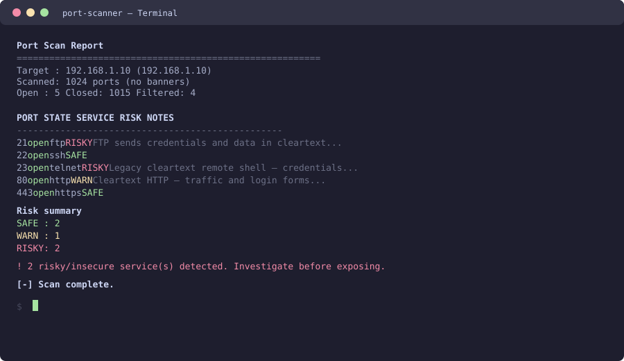
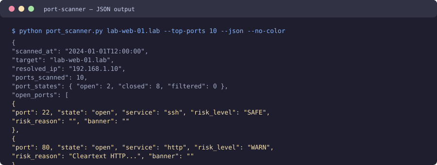

# Port Scanner — Scanner Leve de Portas TCP e Risco de Serviços / Lightweight TCP Port & Service-Risk Scanner

> 🌐 **Idiomas / Languages:** [Português (Brasil)](#português-brasil) · [English](#english)

---

# Português (Brasil)

Uma CLI **sem dependências** em Python para diagnóstico de rede: escaneie um host em busca de portas TCP abertas, identifique o serviço em execução e receba uma **avaliação educacional de risco** de serviços inseguros ou comumente vulneráveis, como telnet, FTP, SMB, RDP, bancos de dados sem autenticação e outros.

> ⚠️ **Somente uso autorizado.** Escaneie apenas sistemas que você possui ou para os quais tem **permissão explícita por escrito** para testar. A varredura de portas sem autorização pode ser ilegal e constitui acesso não autorizado em muitas jurisdições. Esta ferramenta é para educação e diagnóstico defensivo.

 -brightgreen) 

---

## Funcionalidades

- **Varredura de conexão TCP** — não interativa, sem sockets brutos, sem `sudo`.
- **Seleção flexível de portas** — porta única, lista separada por vírgulas, intervalo (`1-1024`), misto (`80,443,8000-8100`) ou as **top-ports** mais comuns.
- **Concorrente e com timeout** — concorrência por thread-pool e timeout por porta mantêm a varredura rápida e segura.
- **Identificação de serviço** — tabela curada de portas conhecidas além de uma leitura de melhor esforço do arquivo `/etc/services` do SO.
- **Classificação de risco** — cada porta aberta recebe um selo `SAFE` / `WARN` / `RISKY` com uma justificativa *defensiva e acionável*.
- **Captura de banner** — leitura opcional e com tempo limitado do banner em portas abertas para confirmar o serviço em execução.
- **Saída `--json`** — resultados legíveis por máquina para encadear em outras ferramentas.
- **Interrupção limpa** — `Ctrl+C` imprime um resumo parcial em vez de morrer no meio da tabela.

## Por que este projeto

Inventário de rede e avaliação de exposição são habilidades defensivas fundamentais. Este projeto mostra como funciona um motor de varredura por conexão sob o capô — `socket` + `concurrent.futures` — e como a inteligência de serviço/risco é aplicada à saída, tudo sem uma única dependência de terceiros. É um artefato de aprendizado limpo e auditável.

## Arquitetura

```
port_scanner.py          # Ponto de entrada da CLI: argparse, construção da lista de portas, códigos de saída
└── scanner/
    ├── service_db.py    # Tabela porta→serviço + base de classificação de risco (RISK_TABLE)
    ├── scanner_core.py  # Motor de varredura por conexão concorrente (PortScanner, PortResult)
    ├── banner_grabber.py# Captura de banner com proteção + inferência banner→serviço
    └── report.py        # Tabela de console + construtores de relatório JSON
```

O fluxo: `port_scanner.py` resolve o host e constrói a lista de portas → `PortScanner.scan()` distribui as sondagens em um thread-pool → cada `PortResult` é classificado por `ServiceDB` (e, opcionalmente, enriquecido com um banner) → `report.py` renderiza a tabela ou o JSON.

## Instalação

```bash
git clone https://github.com/Gmotas/port-scanner.git
cd port-scanner
# Não precisa instalar nada — o núcleo roda em Python 3.9+ stdlib.
python port_scanner.py --help
```

Ou instale como um pacote (opcional), que cria o comando `port-scanner`:

```bash
pip install .
port-scanner --help
```

Dependências de desenvolvimento (opcionais, para testes):

```bash
pip install -r requirements.txt   # apenas pytest
```

## Início rápido

```bash
# Escaneie as 100 portas mais comuns na sua própria máquina.
python port_scanner.py 127.0.0.1 --top-ports 100

# Escaneie um intervalo específico em um host que você possui.
python port_scanner.py 192.168.1.10 --ports 1-1024

# Capture banners nas portas abertas.
python port_scanner.py db.internal --ports 22,3306,5432 --banner

# Apenas os achados arriscados, legíveis por máquina.
python port_scanner.py web.example --top-ports 50 --json --no-color
```

### Exemplo de saída

```
Port Scan Report
========================================================
  Target : 192.168.1.10 (192.168.1.10)
  Scanned: 1024 ports (no banners)
  Open   : 5   Closed: 1015   Filtered: 4

  PORT     STATE     SERVICE          RISK    NOTES
  -------------------------------------------------
  21       open      ftp              RISKY   FTP sends credentials and data in cleartext...
  22       open      ssh              SAFE
  23       open      telnet           RISKY   Legacy cleartext remote shell — credentials...
  80       open      http             WARN    Cleartext HTTP — traffic and login forms...
  443      open      https            SAFE

Risk summary
  SAFE : 2
  WARN : 1
  RISKY: 2

! 2 risky/insecure service(s) detected. Investigate before exposing.

[-] Scan complete.
```

### Saída JSON

```bash
python port_scanner.py web.example --top-ports 10 --json
```

```json
{
  "scanned_at": "2024-01-01T12:00:00",
  "target": "web.example",
  "resolved_ip": "93.184.216.34",
  "ports_scanned": 10,
  "port_states": { "open": 2, "closed": 8, "filtered": 0 },
  "open_ports": [
    { "port": 22, "state": "open", "service": "ssh", "risk_level": "SAFE",
      "risk_reason": "", "banner": "" },
    { "port": 80, "state": "open", "service": "http", "risk_level": "WARN",
      "risk_reason": "Cleartext HTTP...", "banner": "" }
  ]
}
```

## Classificação de risco

A `RISK_TABLE` embutida marca serviços inseguros / comumente vulneráveis. Exemplos principais:

| Porta | Serviço | Risco | Por quê (educacional) |
| --- | --- | --- | --- |
| 21 | ftp | RISKY | Credenciais e dados em texto claro; credenciais anônimas/padrão comuns. |
| 23 | telnet | RISKY | Shell remoto em texto claro; credenciais padrão comuns em equipamentos. |
| 445 | microsoft-ds | RISKY | SMB — CVEs históricas de execução remota; credenciais padrão fracas. |
| 3389 | rdp | RISKY | Área de trabalho remota — riscos de força bruta e acesso exposto. |
| 161 | snmp | RISKY | Strings de comunidade `public`/`private` padrão expõem configurações. |
| 80 | http | WARN | Texto claro — tráfego e formulários de login interceptáveis. |
| 3306 | mysql | WARN | Banco de dados — verifique credenciais fracas/padrão e exposição. |

Estenda-a editando `RISK_TABLE` em `scanner/service_db.py` — adicione uma porta como `RiskRule(RISK_WARN | RISK_RISKY, "sua nota defensiva")`.

## Notas de uso

- `--min-port` / `--max-port` escaneiam um intervalo diretamente (padrão `1-1024`).
- `--just-important` imprime apenas portas abertas (uma por linha, separadas por tabulação) para fácil uso com grep.
- `--no-risk` desativa a classificação e reporta toda porta aberta como `SAFE`.
- `--concurrency` e `--timeout` ajustam velocidade vs. confiabilidade; reduza o timeout em links confiáveis.
- Códigos de saída: `0` limpo, `1` serviço arriscado encontrado ou varredura abortada, `2` erro de uso.

## Testes

```bash
pip install pytest
pytest -q
```

A suíte de testes cobre o construtor de lista de portas, a classificação de serviço/risco, os construtores de relatório e a inferência de banner — sem precisar de acesso à rede.

## Capturas de tela

Os mockups de terminal abaixo mostram o **Port Scanner em ação** — portas abertas, serviço identificado e classificação de risco. (Arquivos em `screenshots/`.)

| **Scanner em ação** | **Saída JSON** |
| --- | --- |
|  |  |
| *Varredura TCP com identificação de serviço e risco (telnet/FTP como RISKY, SSH/HTTPS como SAFE).* | *Saída legível por máquina com ports_scanned e open_ports.* |

## Aviso / Uso ético

Esta é uma ferramenta **educacional**. Ela executa **apenas varreduras por conexão TCP** (nunca intrusivas, nunca um ataque de DoS). Use-a **somente contra hosts que você possui ou para os quais tem permissão explícita por escrito para testar**. A varredura de portas sem autorização é ilegal em muitas jurisdições. As classificações de risco são informacionais e defensivas — elas dizem a um dono de rede *o que verificar*, nunca como atacar. A saída de exemplo é ilustrativa.

## Licença

MIT. Veja o `LICENSE` (ou a raiz do repositório) para detalhes.

---

# English

A **dependency-free** Python CLI for network diagnostics: scan a host for open TCP ports, identify the listening service, and get an **educational risk assessment** of insecure or commonly vulnerable services such as telnet, FTP, SMB, RDP, unauthenticated databases and more.

> ⚠️ **Authorized use only.** Only scan systems you own or have **explicit written permission** to test. Port scanning without authorization may be illegal and constitutes unauthorized access in many jurisdictions. This tool is for education and defensive diagnostics.

 -brightgreen) 

---

## Features

- **TCP connect scan** — non-interactive, no raw sockets, no `sudo` required.
- **Flexible port selection** — single port, comma list, range (`1-1024`), mixed (`80,443,8000-8100`), or curated **top ports**.
- **Concurrent + timed** — thread-pool concurrency and per-port timeouts keep scans fast and safe.
- **Service identification** — curated well-known port table plus a best-effort read of the OS `/etc/services`-style file.
- **Risk classification** — each open port gets a `SAFE` / `WARN` / `RISKY` badge with an *actionable, defensive* reason.
- **Banner grabbing** — optional, hard-capped banner read on open ports to confirm the running service.
- **`--json` output** — machine-readable results for piping into other tools.
- **Clean interruption** — `Ctrl+C` prints a partial summary instead of dying mid-table.

## Why this project

Network inventory and exposure assessment are foundational defensive skills. This project shows how a connect-scan engine works under the hood — `socket` + `concurrent.futures` — and how service/risk intelligence is applied to scan output, all without a single third-party dependency. It's a clean, auditable learning artifact.

## Architecture

```
port_scanner.py          # CLI entry point: arg parsing, port-list building, exit codes
└── scanner/
    ├── service_db.py    # Port→service table + risk-classification DB (RISK_TABLE)
    ├── scanner_core.py  # Concurrent connect scan engine (PortScanner, PortResult)
    ├── banner_grabber.py# Guarded banner grab + banner→service inference
    └── report.py        # Console table + JSON report builders
```

The flow: `port_scanner.py` resolves the host and builds the port list → `PortScanner.scan()` fans out probes across a thread pool → each `PortResult` is classified by `ServiceDB` (and optionally enriched with a banner) → `report.py` renders the table or JSON.

## Installation

```bash
git clone https://github.com/Gmotas/port-scanner.git
cd port-scanner
# No install required — the core runs on Python 3.9+ stdlib.
python port_scanner.py --help
```

Or install it as a package (optional), which creates the `port-scanner` command:

```bash
pip install .
port-scanner --help
```

Dev deps (for the tests) are optional:

```bash
pip install -r requirements.txt   # pytest only
```

## Quickstart

```bash
# Scan the 100 most common ports on your own machine.
python port_scanner.py 127.0.0.1 --top-ports 100

# Scan a specific range on a host you own.
python port_scanner.py 192.168.1.10 --ports 1-1024

# Grab banners on open ports.
python port_scanner.py db.internal --ports 22,3306,5432 --banner

# Just the risky findings, machine-readable.
python port_scanner.py web.example --top-ports 50 --json --no-color
```

### Sample output

```
Port Scan Report
========================================================
  Target : 192.168.1.10 (192.168.1.10)
  Scanned: 1024 ports (no banners)
  Open   : 5   Closed: 1015   Filtered: 4

  PORT     STATE     SERVICE          RISK    NOTES
  -------------------------------------------------
  21       open      ftp              RISKY   FTP sends credentials and data in cleartext...
  22       open      ssh              SAFE
  23       open      telnet           RISKY   Legacy cleartext remote shell — credentials...
  80       open      http             WARN    Cleartext HTTP — traffic and login forms...
  443      open      https            SAFE

Risk summary
  SAFE : 2
  WARN : 1
  RISKY: 2

! 2 risky/insecure service(s) detected. Investigate before exposing.

[-] Scan complete.
```

### JSON output

```bash
python port_scanner.py web.example --top-ports 10 --json
```

```json
{
  "scanned_at": "2024-01-01T12:00:00",
  "target": "web.example",
  "resolved_ip": "93.184.216.34",
  "ports_scanned": 10,
  "port_states": { "open": 2, "closed": 8, "filtered": 0 },
  "open_ports": [
    { "port": 22, "state": "open", "service": "ssh", "risk_level": "SAFE",
      "risk_reason": "", "banner": "" },
    { "port": 80, "state": "open", "service": "http", "risk_level": "WARN",
      "risk_reason": "Cleartext HTTP...", "banner": "" }
  ]
}
```

## Risk classification

The built-in `RISK_TABLE` marks insecure / commonly-vulnerable services. Key examples:

| Port | Service | Risk | Why (educational) |
| --- | --- | --- | --- |
| 21 | ftp | RISKY | Credentials and data sent in cleartext; anonymous/default creds common. |
| 23 | telnet | RISKY | Cleartext remote shell; default credentials common on gear. |
| 445 | microsoft-ds | RISKY | SMB — historic remote-execution CVEs; weak default creds. |
| 3389 | rdp | RISKY | Remote desktop — brute-force and exposed access risks. |
| 161 | snmp | RISKY | Default `public`/`private` community strings expose configs. |
| 80 | http | WARN | Cleartext — sniffable traffic and login forms. |
| 3306 | mysql | WARN | Database — check for weak/default credentials and exposure. |

Extend it by editing `RISK_TABLE` in `scanner/service_db.py` — add a port as a `RiskRule(RISK_WARN | RISK_RISKY, "your defensive note")`.

## Usage notes

- `--min-port` / `--max-port` scan a range directly (default `1-1024`).
- `--just-important` prints only open ports (one per line, tab-separated) for easy grep.
- `--no-risk` disables classification and reports every open port as `SAFE`.
- `--concurrency` and `--timeout` tune speed vs. reliability; lower timeout on reliable links.
- Exit codes: `0` clean, `1` risky service found or scan aborted, `2` usage error.

## Testing

```bash
pip install pytest
pytest -q
```

The test suite covers the port-list builder, service/risk classification, report builders and banner inference — no network access needed.

## Screenshots

The terminal mockups below show the **Port Scanner in action** — open ports, identified service and risk classification. (Files in `screenshots/`.)

| **Scanner in action** | **JSON output** |
| --- | --- |
|  |  |
| *TCP scan with service identification and risk (telnet/FTP as RISKY, SSH/HTTPS as SAFE).* | *Machine-readable output with ports_scanned and open_ports.* |

## Disclaimer / Ethical Use

This is an **educational tool**. It performs **TCP connect scans only** (never intrusive, never a DoS). Use it **only against hosts you own or have explicit written permission to test**. Port scanning without authorization is illegal in many jurisdictions. The risk classifications are informational and defensive — they tell a network owner *what to check*, never how to attack. Sample output is illustrative.

## License

MIT. See `LICENSE` (or the repo root) for details.
